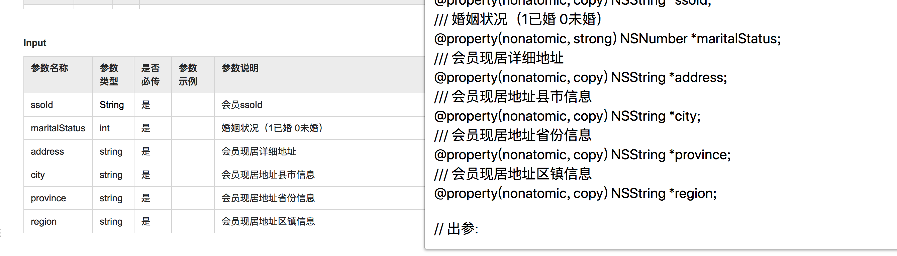
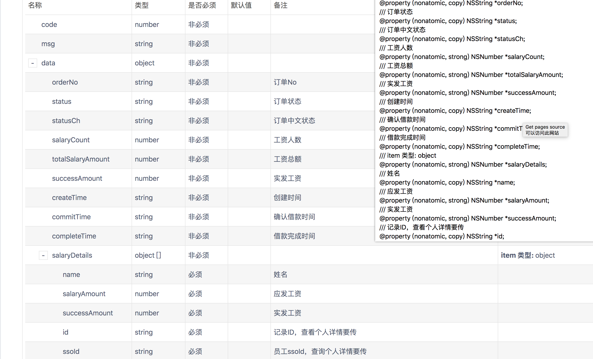
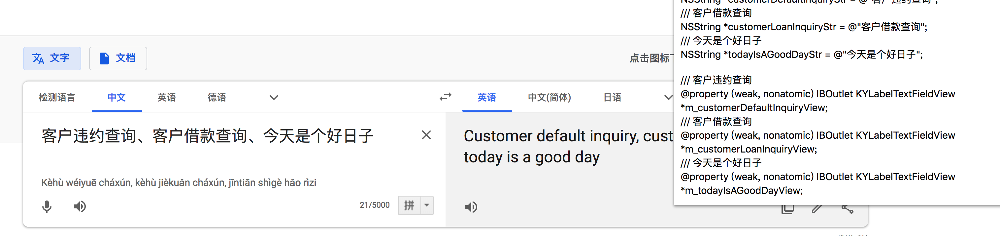
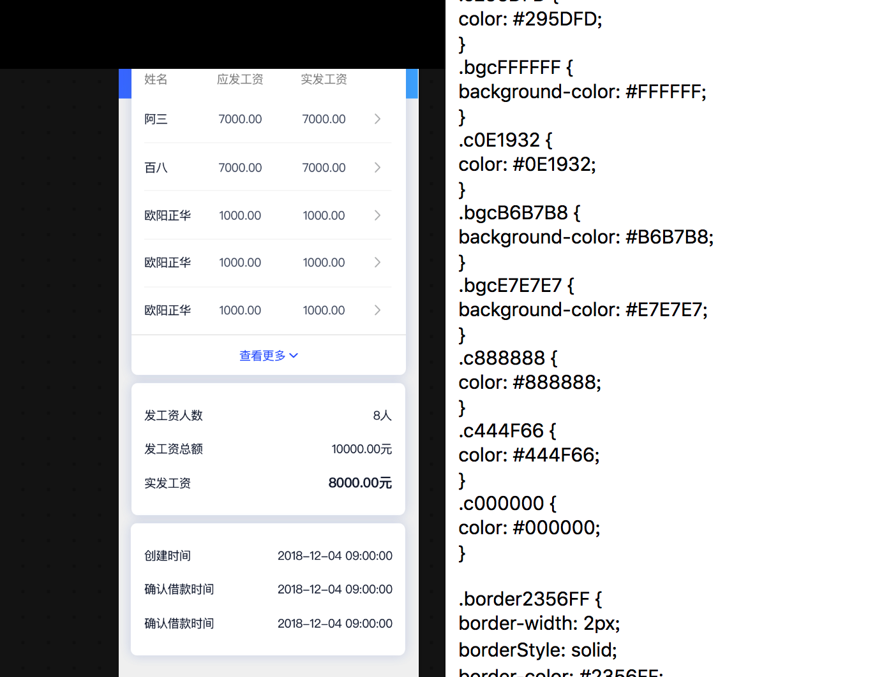

---
1.针对 https://yapi.ymfe.org/ 、wiki 的后台接口文档生成iOS里的property（针对公司内网的接口文档也能识别，得具体分析dom结点根据实际场景修改）
<!--  -->

<!--  -->

---
2.谷歌翻译、百度翻译、有道翻译生成iOS的属性，接线property
<!--  -->

---
3.gitLab对merge_requests时自动填入提交记录
<!--  -->

---
4.DNS排序
http://tool.chinaz.com/dns?type=1&host=github.com&ip=
<!--  -->

---
5.Sketch到Weex
<!--  -->

